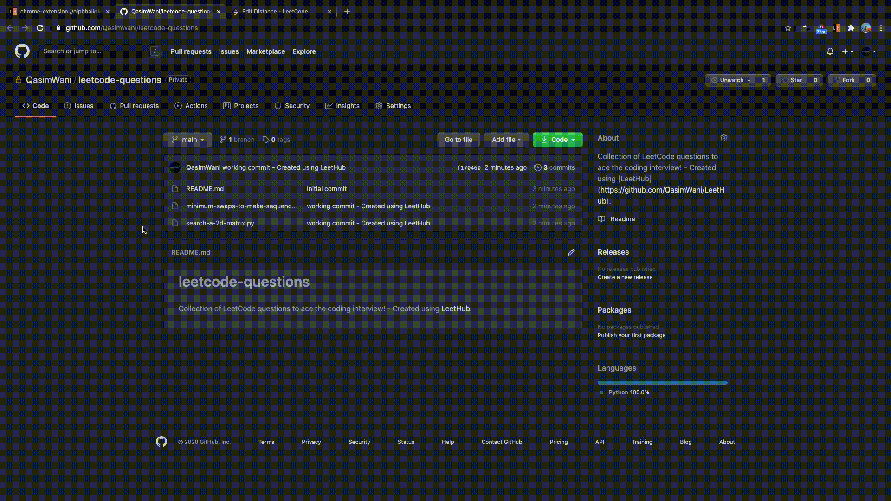

<h1 align="center">
  
   
  LeetHub - Automatically sync your code to GitHub.
   
   
</h1>

  
  
  
  
  

## Top 5 Trending JavaScript Repositories

### Available on:

<table style="border-collapse: separate;"><tr>
  <td style="border-spacing:2em 0"> 
        
  </td>
  <td style="border-spacing:2em 0"> 
      

  </td>
</tr></table>

## What is LeetHub?

A chrome extension that automatically pushes your code to GitHub when you pass all tests on a <a href="http://leetcode.com/">Leetcode</a> problem. 

## How fast is it really?
### THIS FAST!

## Why LeetHub?

 <strong>1.</strong> Recruiters <em>want</em> to see your contributions to the Open Source community, be it through side projects, solving algorithms/data-structures, or contributing to existing OS projects. 
As of now, GitHub is developers' #1 portfolio. LeetHub just makes it much easier (autonomous) to keep track of progress and contributions on the largest network of engineering community, GitHub.

 <strong>2.</strong> There's no easy way of accessing your leetcode problems in one place!  
Moreover, pushing code manually to GitHub from Leetcode is very time consuming. So, why not just automate it entirely without spending a SINGLE additional second on it? 

## How does LeetHub work?     

It's as simple as:

<ol>
  <li>After installation, launch LeetHub.</li>
  <li>Click on "authorize with GitHub" button to automatically set up your account with LeetHub.</li>
  <li>Setup an existing/new repository with LeetHub (private by default) by clicking "Get Started" button.</li>
  <li>Begin Leetcoding! To view your progress, simply click on the extension!</li>
</ol>

#### BONUS: Star [this repository](https://github.com/QasimWani/LeetHub) for further development of features. If you want a particular feature, simply [request](https://github.com/QasimWani/LeetHub/labels/feature) for it!

## Why did I build LeetHub?

The coding interview is arguably the most important part of your interview process, given you get the interview first. As someone who's received multiple internship offers from Fortune 100 companies, getting the interview in the first place is not easy! 
And that's what LeetHub is supposed to do: indirectly improving your coding skills while improving your portfolio to ACE that interview at <em>insert_name_here</em>!

# Let's see you ACE that coding interview!

# How to get LeetHub to work locally?

<ol>
  <li>Fork this repo</li>
  <li>Go to <a href="chrome://extensions">chrome://extensions</a> </li>
  <li>Enable <a href="https://www.mstoic.com/enable-developer-mode-in-chrome/">Developer mode</a> by toggling the switch on top right corner</li>
  <li>Click 'Load unpacked'</li>
  <li>Select the entire LeetHub folder</li>
</ol>

#### And that should be it! Get Hacking...
